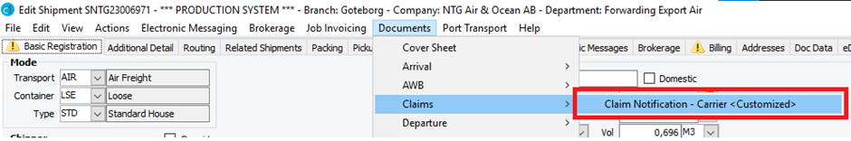

# Creating a Claim

To generate a Claim Notification document in CargoWise One, navigate to the shipment for which you need to issue the claim document for, go to "Documents" and navigate to the "Claims" section. From here select the document "Claim Notification"

This will pull all relevant information from the shipment and generate a claim notification document.

# Adding custom remarks

You can add custom remarks to your claim notification document by going to the "Notes" tab on the shipment, and adding a custom note called "Claim Notification Document". In this note you can write whatever custom text you need to appear on the document:

When you print the claim notification document, you will be able to see the custom note added on the document under the section "Remarks" as per below screenshot:

