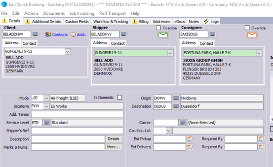
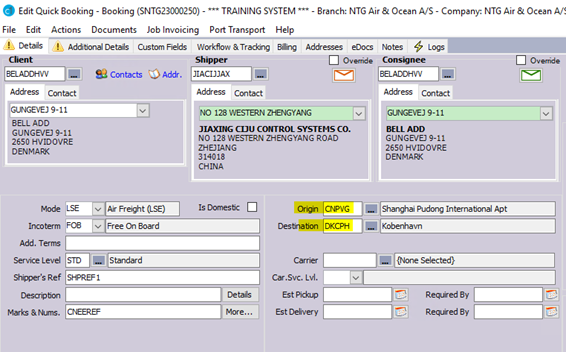

# General Process
This section describes the standard process for creating a one-off quotation, converting it into a booking, and converting the booking into a shipment while attaching it to a consolidation. This process applies to all transport modes, including airfreight, ocean freight, and road transportation. The instructions in this section provide a high-level overview of the steps involved in this process, and they should be used in conjunction with the detailed instructions provided in the rest of this document under each different transportation mode and type.

Below is the process flow of how the high-level process of creating a new shipment for a customer – from the first quotation given, to converting that to a booking and finally, after the customer's approval, convert it to a shipment with a consolidation.

**One Off Quote** → **Booking** →  **Shipment** → **Consolidation**

1. Create a one-off quotation:
   - Navigate to "Manage" > "Tariff & Rates" > "One off Quotes"
   - In the "One Off Quote" screen, click the "New" button to create a new quote.
   - Enter the relevant information that pertains to the movement (air, ocean, road), such as the origin and destination, the type of goods being shipped, and any special requirements or instructions. For a complete list of required and relevant information, refer to the specific instructions in this document.
   - Once the quote is complete, click the "Save" button to save it.
   - To send the quotation to the client, click on the "Print" button. Click "No" to finalize the quote to send it to the client in a draft status. If you finalize it, the quote will be locked for further changes.

2. Convert the quotation to a booking:
   - Open the One-Off quote and click on the "Convert to Booking with Quote" button in the bottom bar.
   - Enter the relevant information that pertains to the movement (air, ocean, road), such as the client's details and the details of the shipment. For a complete list of required and relevant information, refer to the specific instructions in this document.
   - Once the booking is complete, click the "Save" button to save it and send a booking confirmation to the client.

3. Convert the booking into a shipment and fill in the remaining details:
   - Open the booking and click on "Actions" > "Consolidate" in the top bar to convert the booking into a shipment and add it to a new consolidation.
   - Fill out the remaining information on the consolidation level and navigate to the shipment to do the same. For a complete list of required and relevant information, refer to the specific instructions in this document.

This is a very brief and high-level overview that shows the lifecycle of a shipment in CargoWise One.

# Related Parties
A shipment / consolidation has multiple different parties involved. This can for example be the shipper, consignee, local client, pickup transport company and so on.  For billing- and data quality purposes it is very important that the parties are entered correctly and are reflecting the real-life shipment.

## Local client vs Shipper vs Consignee
By design, the Local client will default based on Direction EXP /IMP and the "Shipper Entity" (this can be overridden if required but may then have some negative implications). Essentially a Local client is always either a Shipper or a Consignee (very rarely a Forwarder - very odd cases only).

Below are two examples (one for export and one for import). The examples are shown on booking level, but the same mechanism apply on shipments.
You should be aware that if manipulated, your own billing defaults and that of your NTG partner will likely not work as intended.

### Example for Export
In the below example, "Local Client" will default to the Danish shipper entity when you save the booking.

### Example for Import
In the below example, the "Local Client" will default to the Danish consignee entity when you save the booking. 

## Forwarder/Agents
A forwarder/agent is not a local client and should not be entered as such. A forwarder/agent is a partner we bill (also known as a "Transport Client"). Therefore, the only place a Forwarder/Agent should appear in a Shipment will be on either a Notify Party or the Overseas Agent in the Billing Screen.

## Controlling Office
There is a dimension of ownership of files and "who does what" in terms of origin and destination offices.

## CargoWise Bookings (CWG)
The following table shows the responsible parties and the split between the controlling- and the nominated office when two CargoWise One countries are involved in a booking.

|              | Controlling Office                                        | Nominated Office  |
|--------------|------------------------------------------------------------|-------------------|
| Export       | Create Booking / Convert to Shipment / Send Pre-alert      | Complete Service  |

## CargoWise Bookings (Non-CWG)
The following table shows the responsible parties and the split between the controlling- and the nominated office when we are working with external agents.

|              | CWG/NTG (Controlled)                                      | Agent             |
|--------------|------------------------------------------------------------|-------------------|
| Export       | Create Booking / Convert to Shipment / Send Pre-alert / Complete Shipment | Complete Service  |

|              | CWG/NTG (Nominated)                                       | Agent             |
|--------------|------------------------------------------------------------|-------------------|
| Export       | Receive Instruction / Create Booking / Convert to Shipment / Complete Service | Send Instruction  |

## Consol/Shipment Combinations
Further, you can refer to the below table that refers to the possible consol/shipment combinations in CargoWise One based on different criteria:

| Consol Type | Consol Transport | Consol Container Mode | Shipment Transport | Shipment Container | Shipment Type | Conditions                                                     |
|-------------|------------------|-----------------------|--------------------|--------------------|---------------|---------------------------------------------------------------|
| AGT         | SEA              | GRP                   | SEA               | LCL               | STD          | Arranged with our agent, container booked with carrier. Multiple shippers / multiple consignees |
| AGT         | SEA              | FCL                   | SEA               | FCL               | STD          | Arranged with our agent, container booked with carrier. One shipper / 1 consignee |
| AGT         | SEA              | BCN                   | SEA               | BCN               | STD          | Arranged with agent, container booked with carrier. Multiple shippers / 1 consignee |
| CLD         | SEA              | LCL                   | SEA               | LCL               | STD          | Arranged with our agents, but shipment is booked with a co-loader |
| CLD         | SEA              | BCN                   | SEA               | BCN               | STD          | Arranged with our agents, but shipment(s) are booked with a co-loader |
| CLD         | SEA              | FCL                   | SEA               | FCL               | STD          | Arranged with agents but container booked through co-loader. |
| DRT         | SEA              | FCL                   | SEA               | FCL               | STD          | Arranged directly by shipper/consignee with carrier. NTG is simply a notify agent. |
| DRT         | SEA              | LCL                   | SEA               | LCL               | STD          | Arranged directly by shipper/consignee with co-loader. NTG is simply a notify agent. |
| AGT         | AIR              | LSE                   | AIR               | LSE               | STD          | Arranged with our agent, booked with carrier. Multiple or Single shipments |
| AGT         | AIR              | BCN                   | AIR               | BCN               | STD          | Arranged with agent, booked with carrier. Multiple shippers / 1 consignee |
| DRT         | AIR              | LSE                   | AIR               | LSE               | STD          | Arranged directly by shipper/consignee with carrier. NTG is simply a notify agent. |
| AGT         | ROA              | FTL                   | ROA               | FTL               | STD          | Arranged with our agent, FTL booked with carrier. One shipper / 1 consignee |
| AGT         | ROA              | LTL                   | ROA               | LTL               | STD          | Arranged with our agent, LTL booked with carrier. One shipper / 1 consignee |
| AGT         | RAI              | FCL                   | RAI               | FCL               | STD          | Arranged with our agent, FCL booked with carrier. One shipper / 1 consignee |

# Digging deeper
The process described in this document is showing a high-level how the process flows from quotation to final shipment. 

Refer to the specific SOPs for each movement- and transport type:

| Type         | Link               |
|--------------|--------------------|
| Airfreight   | ...                |
| Ocean freight| ...                |
